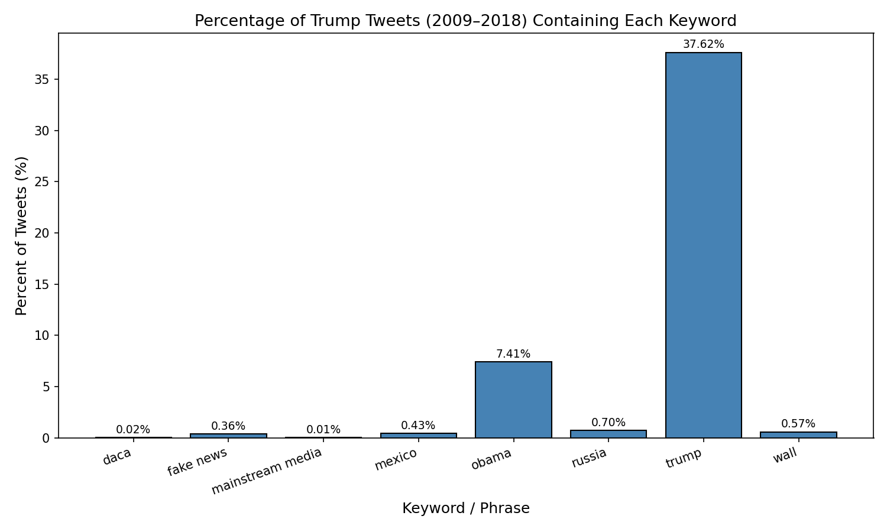
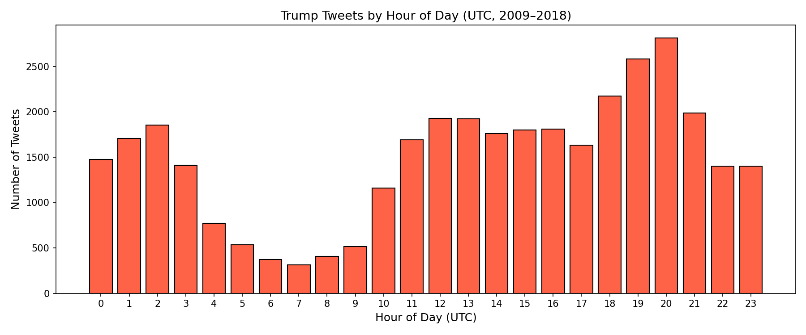

# Trump Tweet Analysis

This program analyzes 35,402 tweets sent by Donald Trump from 2009–2018, counting how often key phrases appear and visualizing the results.

## Keyword Frequency Table

|           phrase | percent of tweets |
| ---------------- | ----------------- |
|             daca | 00.02             |
|        fake news | 00.36             |
| mainstream media | 00.01             |
|           mexico | 00.43             |
|            obama | 07.41             |
|           russia | 00.70             |
|            trump | 37.62             |
|             wall | 00.57             |

## Keyword Bar Chart

The bar chart below shows the percentage of tweets containing each keyword.

## Tweets by Hour of Day (Extra Credit)

This chart shows which hours of the day (UTC) Trump tweets most frequently.

